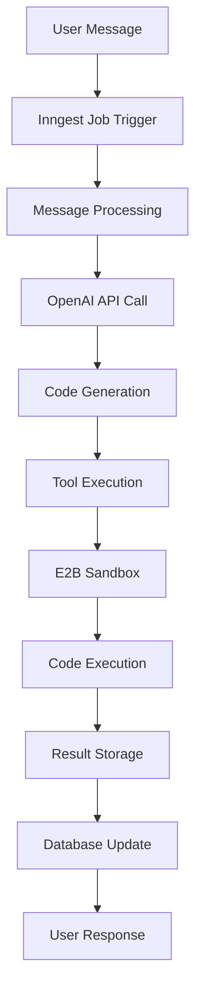

## Overview

NovaCraft's agent system is the core of the AI-powered code generation platform. Built on Inngest for reliable background job processing and OpenAI's GPT-4 for intelligent code generation, the system provides secure, scalable, and intelligent code creation capabilities.

## Agent Architecture

<CardGroup cols={3}>
  <Card
    title="Inngest Orchestration"
    icon="workflow"
    href="#inngest-orchestration"
  >
    Background job processing and workflow management
  </Card>
  <Card
    title="OpenAI Integration"
    icon="brain"
    href="#openai-integration"
  >
    GPT-4 powered code generation and analysis
  </Card>
  <Card
    title="E2B Execution"
    icon="terminal"
    href="#e2b-execution"
  >
    Secure sandbox environments for code execution
  </Card>
</CardGroup>

## System Flow

The agent system follows a structured workflow from user input to code execution:



## Inngest Orchestration

### Agent Function Definition

The main agent function is defined in `src/inngest/functions.ts`:

```typescript src/inngest/functions.ts
export const agent = inngest.createFunction(
  {
    id: "agent",
    name: "AI Agent for Code Generation",
    retries: 3,
    concurrency: {
      limit: 10,
      key: "event.data.projectId"
    }
  },
  { event: "message.created" },
  async ({ event, step }) => {
    // Agent processing logic
  }
);
```

### Key Features

<AccordionGroup>
  <Accordion title="Reliability">
    - **Retry Logic**: Automatic retry on failures with exponential backoff
    - **Error Handling**: Comprehensive error catching and logging
    - **Timeout Management**: Configurable timeouts for long-running operations
  </Accordion>
  
  <Accordion title="Scalability">
    - **Concurrency Control**: Limits concurrent jobs per project
    - **Resource Management**: Efficient memory and CPU usage
    - **Queue Management**: Intelligent job prioritization
  </Accordion>
  
  <Accordion title="Monitoring">
    - **Job Tracking**: Real-time job status and progress
    - **Metrics Collection**: Performance and success metrics
    - **Logging**: Comprehensive logging for debugging
  </Accordion>
</AccordionGroup>

### Job Lifecycle

<CodeGroup>

```typescript Job Creation
// Trigger agent job from user message
await inngest.send({
  name: "message.created",
  data: {
    messageId: message.id,
    projectId: project.id,
    content: message.content,
    role: message.role
  }
});
```

```typescript Job Processing
export const agent = inngest.createFunction(
  { id: "agent" },
  { event: "message.created" },
  async ({ event, step }) => {
    // Step 1: Load message context
    const context = await step.run("load-context", async () => {
      return await loadMessageContext(event.data.messageId);
    });
    
    // Step 2: Generate AI response
    const response = await step.run("generate-response", async () => {
      return await generateAIResponse(context);
    });
    
    // Step 3: Execute tools if needed
    const result = await step.run("execute-tools", async () => {
      return await executeTools(response.toolCalls);
    });
    
    // Step 4: Save results
    await step.run("save-results", async () => {
      return await saveResults(result);
    });
  }
);
```

</CodeGroup>

## OpenAI Integration

### Model Configuration

```typescript OpenAI Setup
const openai = new OpenAI({
  apiKey: process.env.OPENAI_API_KEY,
  baseURL: process.env.OPENAI_BASE_URL, // Optional custom endpoint
});

const MODEL_CONFIG = {
  model: "gpt-4-turbo-preview",
  temperature: 0.1,
  max_tokens: 4000,
  top_p: 1,
  frequency_penalty: 0,
  presence_penalty: 0
};
```

### Message Processing

<CodeGroup>

```typescript System Prompt
const SYSTEM_PROMPT = `You are an expert software engineer AI assistant helping users create applications.

You have access to these tools:
1. terminal - Execute shell commands
2. createOrUpdateFiles - Create or modify files
3. readFiles - Read existing files

When generating code:
- Write clean, well-documented code
- Use modern best practices
- Include error handling
- Follow the project's existing patterns
- Ensure code is production-ready

Always explain your approach and reasoning.`;
```

```typescript Message Context
async function buildMessageContext(messageId: string) {
  const message = await prisma.message.findUnique({
    where: { id: messageId },
    include: {
      project: {
        include: {
          messages: {
            include: {
              fragments: true
            },
            orderBy: {
              createdAt: 'asc'
            }
          }
        }
      }
    }
  });
  
  // Build conversation history
  const conversationHistory = message.project.messages.map(msg => ({
    role: msg.role.toLowerCase(),
    content: msg.content,
    fragments: msg.fragments.map(f => ({
      sandboxUrl: f.sandboxUrl,
      fileContent: f.fileContent
    }))
  }));
  
  return {
    currentMessage: message,
    conversationHistory,
    projectContext: message.project
  };
}
```

</CodeGroup>

### Tool System

The agent has access to three main tools for code generation and execution:

#### 1. Terminal Tool

```typescript Terminal Tool
{
  type: "function",
  function: {
    name: "terminal",
    description: "Execute shell commands in the sandbox environment",
    parameters: {
      type: "object",
      properties: {
        command: {
          type: "string",
          description: "The shell command to execute"
        }
      },
      required: ["command"]
    }
  }
}
```

#### 2. File Management Tool

```typescript File Management
{
  type: "function",
  function: {
    name: "createOrUpdateFiles",
    description: "Create or update files in the sandbox",
    parameters: {
      type: "object",
      properties: {
        files: {
          type: "array",
          items: {
            type: "object",
            properties: {
              path: { type: "string", description: "File path" },
              content: { type: "string", description: "File content" }
            },
            required: ["path", "content"]
          }
        }
      },
      required: ["files"]
    }
  }
}
```

#### 3. File Reading Tool

```typescript File Reading
{
  type: "function",
  function: {
    name: "readFiles",
    description: "Read existing files from the sandbox",
    parameters: {
      type: "object",
      properties: {
        paths: {
          type: "array",
          items: { type: "string" },
          description: "Array of file paths to read"
        }
      },
      required: ["paths"]
    }
  }
}
```

## E2B Execution

### Sandbox Management

<CodeGroup>

```typescript Sandbox Creation
async function createSandbox(projectId: string) {
  const sandbox = await Sandbox.create({
    template: "novacraft-nextjs-test",
    metadata: {
      projectId,
      createdAt: new Date().toISOString()
    }
  });
  
  // Initialize sandbox with base configuration
  await sandbox.runCommand("npm install");
  await sandbox.runCommand("npm run build");
  
  return sandbox;
}
```

```typescript Tool Execution
async function executeTools(toolCalls: ToolCall[], sandboxId: string) {
  const sandbox = await Sandbox.connect(sandboxId);
  const results = [];
  
  for (const toolCall of toolCalls) {
    switch (toolCall.function.name) {
      case "terminal":
        const result = await sandbox.runCommand(
          toolCall.function.arguments.command
        );
        results.push({
          toolCallId: toolCall.id,
          output: result.stdout,
          error: result.stderr
        });
        break;
        
      case "createOrUpdateFiles":
        const files = toolCall.function.arguments.files;
        for (const file of files) {
          await sandbox.filesystem.write(file.path, file.content);
        }
        results.push({
          toolCallId: toolCall.id,
          output: `Created/updated ${files.length} files`
        });
        break;
        
      case "readFiles":
        const paths = toolCall.function.arguments.paths;
        const fileContents = await Promise.all(
          paths.map(async path => {
            const content = await sandbox.filesystem.read(path);
            return { path, content };
          })
        );
        results.push({
          toolCallId: toolCall.id,
          output: JSON.stringify(fileContents, null, 2)
        });
        break;
    }
  }
  
  return results;
}
```

</CodeGroup>

### Sandbox Security

<AccordionGroup>
  <Accordion title="Isolation">
    - **Process Isolation**: Each sandbox runs in isolated containers
    - **Network Restrictions**: Limited network access to prevent abuse
    - **Resource Limits**: CPU, memory, and disk space restrictions
  </Accordion>
  
  <Accordion title="Lifecycle Management">
    - **Automatic Cleanup**: Sandboxes are automatically cleaned up after use
    - **Timeout Protection**: Jobs are terminated after maximum runtime
    - **Resource Monitoring**: Continuous monitoring of resource usage
  </Accordion>
  
  <Accordion title="Data Protection">
    - **Temporary Storage**: All files are temporary and cleaned up
    - **No Persistent Data**: No data persists between sandbox sessions
    - **Secure Communication**: All communication is encrypted
  </Accordion>
</AccordionGroup>

## Error Handling

### Error Types and Recovery

<CodeGroup>

```typescript Error Classification
enum AgentErrorType {
  OPENAI_API_ERROR = "openai_api_error",
  SANDBOX_ERROR = "sandbox_error",
  TOOL_EXECUTION_ERROR = "tool_execution_error",
  DATABASE_ERROR = "database_error",
  TIMEOUT_ERROR = "timeout_error"
}

class AgentError extends Error {
  constructor(
    public type: AgentErrorType,
    public message: string,
    public cause?: Error,
    public recoverable: boolean = true
  ) {
    super(message);
  }
}
```

```typescript Error Handling
async function handleAgentError(error: AgentError, context: AgentContext) {
  // Log error with context
  console.error("Agent Error:", {
    type: error.type,
    message: error.message,
    projectId: context.projectId,
    messageId: context.messageId,
    timestamp: new Date().toISOString()
  });
  
  // Save error message to database
  await prisma.message.create({
    data: {
      content: `I encountered an error: ${error.message}`,
      role: "ASSISTANT",
      type: "ERROR",
      projectId: context.projectId
    }
  });
  
  // Attempt recovery if possible
  if (error.recoverable) {
    return await retryWithBackoff(context);
  }
  
  throw error;
}
```

</CodeGroup>

## Performance Optimization

### Caching Strategy

<CodeGroup>

```typescript Context Caching
const contextCache = new Map<string, MessageContext>();

async function getCachedContext(messageId: string) {
  if (contextCache.has(messageId)) {
    return contextCache.get(messageId);
  }
  
  const context = await buildMessageContext(messageId);
  contextCache.set(messageId, context);
  
  // Cache expiry
  setTimeout(() => {
    contextCache.delete(messageId);
  }, 5 * 60 * 1000); // 5 minutes
  
  return context;
}
```

```typescript Sandbox Pooling
class SandboxPool {
  private pool: Map<string, Sandbox> = new Map();
  
  async getSandbox(projectId: string): Promise<Sandbox> {
    if (this.pool.has(projectId)) {
      return this.pool.get(projectId)!;
    }
    
    const sandbox = await createSandbox(projectId);
    this.pool.set(projectId, sandbox);
    
    // Auto-cleanup after 30 minutes
    setTimeout(() => {
      this.releaseSandbox(projectId);
    }, 30 * 60 * 1000);
    
    return sandbox;
  }
  
  async releaseSandbox(projectId: string) {
    const sandbox = this.pool.get(projectId);
    if (sandbox) {
      await sandbox.kill();
      this.pool.delete(projectId);
    }
  }
}
```

</CodeGroup>

### Batch Processing

```typescript Batch Operations
async function processBatch(messages: Message[]) {
  const batches = chunkArray(messages, 5); // Process 5 at a time
  
  for (const batch of batches) {
    await Promise.all(
      batch.map(message => 
        processMessage(message).catch(error => {
          console.error(`Failed to process message ${message.id}:`, error);
        })
      )
    );
  }
}
```

## Monitoring and Observability

### Metrics Collection

<CodeGroup>

```typescript Performance Metrics
interface AgentMetrics {
  totalJobs: number;
  successfulJobs: number;
  failedJobs: number;
  averageProcessingTime: number;
  activeJobs: number;
  sandboxUtilization: number;
}

export async function collectMetrics(): Promise<AgentMetrics> {
  const jobs = await inngest.jobs.list();
  const now = Date.now();
  
  return {
    totalJobs: jobs.length,
    successfulJobs: jobs.filter(j => j.status === 'Completed').length,
    failedJobs: jobs.filter(j => j.status === 'Failed').length,
    averageProcessingTime: calculateAverageTime(jobs),
    activeJobs: jobs.filter(j => j.status === 'Running').length,
    sandboxUtilization: await getSandboxUtilization()
  };
}
```

```typescript Health Checks
export async function checkAgentHealth() {
  const checks = await Promise.allSettled([
    checkOpenAIConnection(),
    checkE2BConnection(),
    checkInngestConnection(),
    checkDatabaseConnection()
  ]);
  
  return {
    openai: checks[0].status === 'fulfilled',
    e2b: checks[1].status === 'fulfilled',
    inngest: checks[2].status === 'fulfilled',
    database: checks[3].status === 'fulfilled',
    overall: checks.every(check => check.status === 'fulfilled')
  };
}
```

</CodeGroup>

## Configuration

### Environment Variables

```env Agent Configuration
# OpenAI Configuration
OPENAI_API_KEY=sk-...
OPENAI_BASE_URL=https://api.openai.com/v1  # Optional
OPENAI_MODEL=gpt-4-turbo-preview
OPENAI_MAX_TOKENS=4000
OPENAI_TEMPERATURE=0.1

# E2B Configuration
E2B_API_KEY=your-e2b-api-key
E2B_TEMPLATE=novacraft-nextjs-test
E2B_TIMEOUT=300000  # 5 minutes

# Inngest Configuration
INNGEST_EVENT_KEY=your-inngest-event-key
INNGEST_SIGNING_KEY=your-inngest-signing-key
INNGEST_BASE_URL=https://inn.gs  # Optional

# Agent Configuration
AGENT_CONCURRENCY_LIMIT=10
AGENT_RETRY_ATTEMPTS=3
AGENT_TIMEOUT=600000  # 10 minutes
```

### Feature Flags

```typescript Feature Management
interface AgentFeatures {
  enableCodeExecution: boolean;
  enableFileOperations: boolean;
  enableTerminalAccess: boolean;
  enableAdvancedDebugging: boolean;
  maxSandboxLifetime: number;
  maxConcurrentJobs: number;
}

export const AGENT_FEATURES: AgentFeatures = {
  enableCodeExecution: process.env.ENABLE_CODE_EXECUTION === 'true',
  enableFileOperations: process.env.ENABLE_FILE_OPERATIONS === 'true',
  enableTerminalAccess: process.env.ENABLE_TERMINAL_ACCESS === 'true',
  enableAdvancedDebugging: process.env.NODE_ENV === 'development',
  maxSandboxLifetime: parseInt(process.env.MAX_SANDBOX_LIFETIME || '1800000'),
  maxConcurrentJobs: parseInt(process.env.MAX_CONCURRENT_JOBS || '10')
};
```

## Best Practices

### Code Generation Guidelines

1. **Context Awareness**: Always consider the full conversation history
2. **Incremental Building**: Build upon existing code rather than replacing
3. **Error Handling**: Include proper error handling in generated code
4. **Testing**: Generate tests alongside implementation code
5. **Documentation**: Include comments and documentation

### Tool Usage Patterns

<CodeGroup>

```typescript Effective Tool Usage
// Good: Structured approach
async function createReactComponent(name: string) {
  // 1. First, create the component file
  await createOrUpdateFiles([
    {
      path: `src/components/${name}.tsx`,
      content: generateComponentCode(name)
    }
  ]);
  
  // 2. Then create the test file
  await createOrUpdateFiles([
    {
      path: `src/components/${name}.test.tsx`,
      content: generateTestCode(name)
    }
  ]);
  
  // 3. Finally, run tests to verify
  await terminal("npm test " + name);
}
```

```typescript Error Recovery
// Good: Graceful error handling
async function safeToolExecution(toolCall: ToolCall) {
  try {
    return await executeToolCall(toolCall);
  } catch (error) {
    // Log error for debugging
    console.error("Tool execution failed:", error);
    
    // Attempt alternative approach
    if (toolCall.function.name === "terminal") {
      return await executeAlternativeCommand(toolCall);
    }
    
    // Return error information to user
    return {
      error: true,
      message: "I encountered an issue executing that command. Let me try a different approach."
    };
  }
}
```

</CodeGroup>

## Security Considerations

### Input Validation

```typescript Input Sanitization
function sanitizeUserInput(input: string): string {
  // Remove potentially dangerous commands
  const dangerousPatterns = [
    /rm\s+-rf/gi,
    /sudo/gi,
    /chmod\s+777/gi,
    /curl.*\|.*sh/gi,
    /wget.*\|.*sh/gi
  ];
  
  let sanitized = input;
  dangerousPatterns.forEach(pattern => {
    sanitized = sanitized.replace(pattern, '[REMOVED]');
  });
  
  return sanitized;
}
```

### Sandbox Security

- **Limited Network Access**: Sandboxes can only access approved endpoints
- **Resource Limits**: CPU, memory, and disk space are strictly limited
- **Time Limits**: All operations have maximum execution time
- **File System Restrictions**: No access to sensitive system files

## Next Steps

<CardGroup cols={2}>
  <Card
    title="API Architecture"
    icon="server"
    href="/architecture/api"
  >
    Learn about the tRPC API layer
  </Card>
  <Card
    title="Development Testing"
    icon="test-tube"
    href="/development/testing"
  >
    Test your agent implementations
  </Card>
</CardGroup>