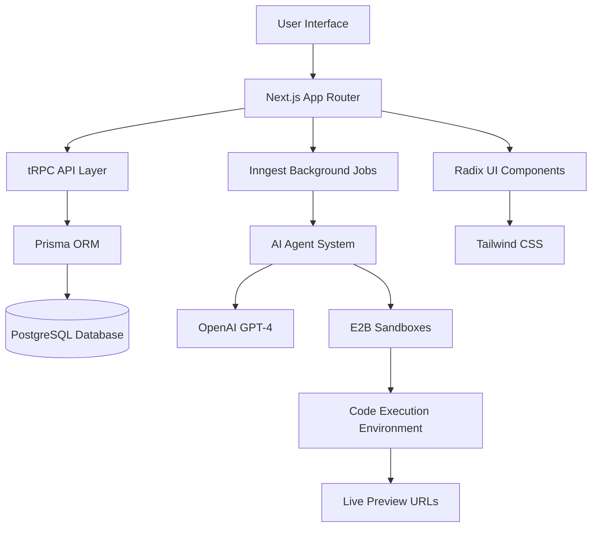
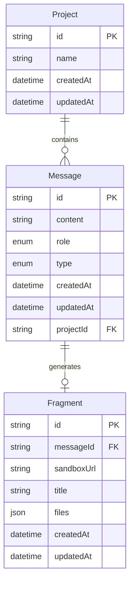

## System Architecture

NovaCraft is built as a modern, scalable web application with a clear separation of concerns. The architecture consists of multiple layers that work together to provide a seamless AI-powered code generation experience.

## Architecture Diagram



## Core Components

### Frontend Layer

<CardGroup cols={2}>
  <Card title="Next.js 15" icon="nextjs">
    App Router with React 19 for server-side rendering and client-side interactions
  </Card>
  <Card title="tRPC Client" icon="code">
    Type-safe API client with React Query for data fetching and caching
  </Card>
  <Card title="Radix UI" icon="component">
    Accessible, unstyled UI components as building blocks
  </Card>
  <Card title="Tailwind CSS" icon="paint-brush">
    Utility-first CSS framework for rapid UI development
  </Card>
</CardGroup>

### Backend Layer

<CardGroup cols={2}>
  <Card title="tRPC Server" icon="server">
    Type-safe API layer with automatic type inference
  </Card>
  <Card title="Prisma ORM" icon="database">
    Type-safe database access with PostgreSQL
  </Card>
  <Card title="Inngest" icon="gear">
    Background job processing for AI agent orchestration
  </Card>
  <Card title="PostgreSQL" icon="database">
    Primary database for storing projects, messages, and fragments
  </Card>
</CardGroup>

### AI & Execution Layer

<CardGroup cols={2}>
  <Card title="Inngest Agent Kit" icon="robot">
    AI agent orchestration with OpenAI GPT-4 integration
  </Card>
  <Card title="E2B Sandboxes" icon="cube">
    Secure, isolated code execution environments
  </Card>
  <Card title="OpenAI GPT-4" icon="brain">
    Large language model for code generation
  </Card>
  <Card title="Code Execution" icon="terminal">
    Terminal, file system, and build tool access
  </Card>
</CardGroup>

## Data Flow

### User Interaction Flow

1. **User Input**: User types a message in the chat interface
2. **API Call**: tRPC mutation sends message to backend
3. **Database Storage**: Message is stored in PostgreSQL
4. **Job Trigger**: Inngest job is triggered for AI processing
5. **AI Processing**: AI agent analyzes request and generates code
6. **Code Execution**: Code is executed in E2B sandbox
7. **Response Storage**: Results are stored as fragments
8. **UI Update**: Frontend receives real-time updates

### Database Schema Flow

<CodeGroup>



</CodeGroup>

## Technology Stack

### Frontend Technologies

<AccordionGroup>
  <Accordion title="Next.js 15 with App Router">
    - **Server Components** for optimal performance
    - **Client Components** for interactive features
    - **API Routes** for tRPC endpoints
    - **Built-in optimization** for images, fonts, and bundling
  </Accordion>
  
  <Accordion title="React 19">
    - **Concurrent rendering** for better user experience
    - **Server Components** for reduced JavaScript bundle size
    - **Automatic batching** for performance optimization
    - **Improved hydration** for faster initial load
  </Accordion>
  
  <Accordion title="TypeScript">
    - **Full type safety** throughout the application
    - **Zod integration** for runtime validation
    - **Prisma types** for database operations
    - **tRPC types** for API contracts
  </Accordion>
  
  <Accordion title="Tailwind CSS">
    - **Utility-first approach** for rapid development
    - **Custom design system** with consistent spacing
    - **Dark mode support** out of the box
    - **Responsive design** utilities
  </Accordion>
</AccordionGroup>

### Backend Technologies

<AccordionGroup>
  <Accordion title="tRPC">
    - **End-to-end type safety** from database to UI
    - **Automatic type inference** for API calls
    - **Built-in validation** with Zod schemas
    - **Real-time subscriptions** support
  </Accordion>
  
  <Accordion title="Prisma">
    - **Type-safe database queries** with full IntelliSense
    - **Database migrations** with version control
    - **Connection pooling** for better performance
    - **Multiple database support** (PostgreSQL, MySQL, SQLite)
  </Accordion>
  
  <Accordion title="PostgreSQL">
    - **ACID compliance** for data integrity
    - **JSON support** for flexible data structures
    - **Full-text search** capabilities
    - **Horizontal scaling** options
  </Accordion>
</AccordionGroup>

### AI & Execution Technologies

<AccordionGroup>
  <Accordion title="Inngest">
    - **Reliable job processing** with retry mechanisms
    - **Event-driven architecture** for scalability
    - **Built-in monitoring** and observability
    - **Workflow orchestration** for complex AI operations
  </Accordion>
  
  <Accordion title="OpenAI GPT-4">
    - **Advanced code generation** capabilities
    - **Context-aware responses** for better results
    - **Function calling** for structured outputs
    - **High-quality natural language understanding**
  </Accordion>
  
  <Accordion title="E2B Sandboxes">
    - **Secure code execution** in isolated environments
    - **Multiple language support** (Node.js, Python, etc.)
    - **Real-time collaboration** features
    - **Built-in package managers** and tools
  </Accordion>
</AccordionGroup>

## Security Architecture

### Data Protection

<CardGroup cols={2}>
  <Card title="Input Validation" icon="shield-check">
    All user inputs validated with Zod schemas before processing
  </Card>
  <Card title="SQL Injection Prevention" icon="database">
    Prisma ORM provides automatic SQL injection protection
  </Card>
  <Card title="Sandbox Isolation" icon="cube">
    E2B provides containerized execution environments
  </Card>
  <Card title="API Rate Limiting" icon="clock">
    Built-in rate limiting to prevent abuse
  </Card>
</CardGroup>

### Access Control

- **No authentication required** for current version (demo/prototype)
- **Project isolation** through database-level separation
- **Sandbox isolation** prevents cross-contamination
- **Resource limits** prevent resource exhaustion

## Performance Considerations

### Frontend Performance

<Tip>
The frontend is optimized for speed with multiple performance strategies.
</Tip>

- **Server-side rendering** for faster initial page loads
- **Code splitting** to reduce bundle sizes
- **Image optimization** with Next.js Image component
- **Caching strategies** with React Query
- **Lazy loading** for non-critical components

### Backend Performance

- **Connection pooling** for database efficiency
- **Query optimization** with Prisma
- **Background processing** with Inngest
- **Caching layers** for frequently accessed data

### AI Processing Performance

- **Streaming responses** for real-time feedback
- **Parallel processing** for multiple AI operations
- **Result caching** for similar requests
- **Timeout handling** for long-running operations

## Scalability Architecture

### Horizontal Scaling

<CardGroup cols={2}>
  <Card title="Stateless Application" icon="server">
    Next.js app can be scaled horizontally across multiple instances
  </Card>
  <Card title="Database Scaling" icon="database">
    PostgreSQL supports read replicas and sharding
  </Card>
  <Card title="Job Processing" icon="gear">
    Inngest can scale job processing across multiple workers
  </Card>
  <Card title="CDN Integration" icon="globe">
    Static assets can be served from a CDN
  </Card>
</CardGroup>

### Vertical Scaling

- **Database optimization** with indexes and query optimization
- **Memory caching** with Redis (future implementation)
- **CPU optimization** with efficient algorithms
- **Storage optimization** with compression and cleanup

## Monitoring & Observability

### Application Monitoring

<CodeGroup>

```typescript Performance Monitoring
// Next.js built-in analytics
export function reportWebVitals(metric: NextWebVitalsMetric) {
  console.log(metric);
  // Send to your analytics service
}

// tRPC request logging
export const loggerMiddleware = t.middleware(({ next, path }) => {
  const start = Date.now();
  
  return next({
    ctx: {
      ...ctx,
      logger: console.log
    }
  }).finally(() => {
    console.log(`${path} took ${Date.now() - start}ms`);
  });
});
```

</CodeGroup>

### Error Tracking

- **Frontend error boundaries** for graceful error handling
- **Backend error logging** with structured logging
- **AI processing error tracking** with retry mechanisms
- **Sandbox error monitoring** with E2B logs

## Development Architecture

### Development Workflow

<CardGroup cols={2}>
  <Card title="Local Development" icon="laptop">
    Full development environment with hot reloading
  </Card>
  <Card title="Database Migrations" icon="database">
    Version-controlled schema changes with Prisma
  </Card>
  <Card title="Type Safety" icon="shield">
    End-to-end type safety from database to UI
  </Card>
  <Card title="Testing Strategy" icon="test-tube">
    Unit tests, integration tests, and E2E tests
  </Card>
</CardGroup>

### Code Organization

```
src/
├── app/                    # Next.js App Router pages
├── components/            # Reusable UI components
├── hooks/                 # Custom React hooks
├── lib/                   # Utility functions and configurations
├── modules/               # Feature-specific modules
│   ├── home/              # Home page functionality
│   ├── projects/          # Project management
│   └── messages/          # Message handling
├── trpc/                  # tRPC configuration and routers
├── inngest/               # Background job definitions
└── generated/             # Generated code (Prisma client)
```

## Future Architecture Considerations

### Planned Enhancements

<CardGroup cols={2}>
  <Card title="Authentication" icon="lock">
    User authentication with NextAuth.js or similar
  </Card>
  <Card title="Real-time Updates" icon="broadcast">
    WebSocket connections for live collaboration
  </Card>
  <Card title="Caching Layer" icon="database">
    Redis for session management and caching
  </Card>
  <Card title="Microservices" icon="grid">
    Split into smaller, focused services
  </Card>
</CardGroup>

### Scaling Considerations

- **Multi-tenancy** for enterprise deployments
- **Geographic distribution** for global users
- **Advanced caching** strategies
- **Event sourcing** for audit trails

## Next Steps

<CardGroup cols={2}>
  <Card
    title="Database Schema"
    icon="database"
    href="/architecture/database"
  >
    Learn about the database design
  </Card>
  <Card
    title="API Architecture"
    icon="code"
    href="/architecture/api"
  >
    Understand the API layer design
  </Card>
</CardGroup>